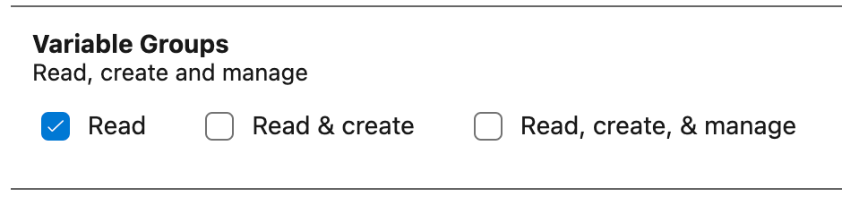

# Azure Devops Variable Library Search & Replace README

This extension will allow you to quickly execute search and replace for tokens in a text file that match variables defined in an Azure Devops Variable Library.

## Features

Automatically lists all of the variable libraries in your Azure DevOps repository and allows you to select from the list.

## Requirements

You must have access to an Azure Devops Project and be able to generate a token that allows read access to variable libraries:

## Extension Settings

The following configuration parameters are required:

- `myExtenazdo-libvar-search-replacesion.org`: The name of your Azure Devops Organization.
- `azdo-libvar-search-replace.project`: The name of your azure-devops project.
- `azdo-libvar-search-replace.pat`: A personal access token that grants access to read variable libraries.
